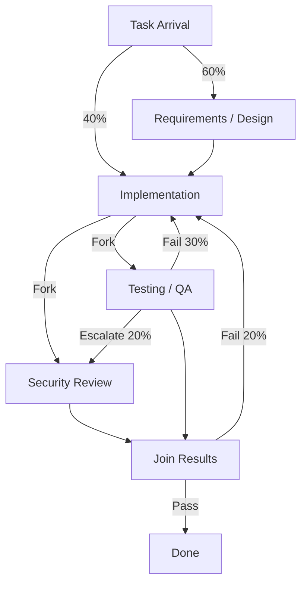

```mermaid
flowchart TD
    A[Task Arrival] -->|60%| D[Requirements / Design]
    A -->|40%| I[Implementation]

    D --> I

    I -->|Fork| S[Security Review]
    I -->|Fork| T[Testing / QA]

%% Synchronization after parallel branches
    S --> J[Join Results]
    T --> J

    J -->|Pass| Done[Done]
    J -->|Fail 20%| I

%% Optional direct rework from Testing
    T -->|Fail 30%| I
    T -->|Escalate 20%| S
```