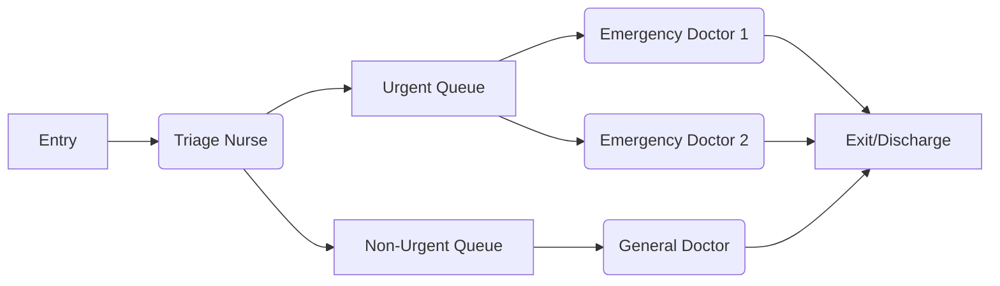
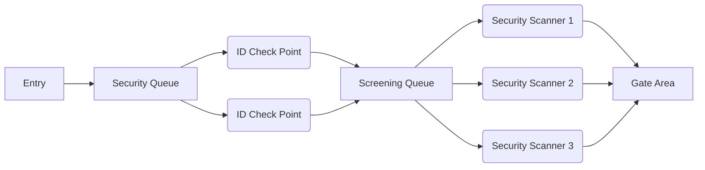

### Task 1
lets take health centre into observation
A=number of patient arriving
C=patients who have seen a doctor and got sent home
B=active consulting time
T=total time simulated, eg one shift duration
U=doctor busy time
X=patients treated per hour
S=average treatement time
Ri=time from arrival to leave
W=wait+treatment time
R=wait time
N=number of patients inside

### Task 2
B,U,S updated in service points
Ri,W updated on customer level
A,C,Y are updated on system level (event end/start)

### Task 3





### Task 4
```
time = 0
A = 0 
C = 0 
B = 0 
T = endTime 
W = 0  
queues = []
servicePoints = []

while (time < T) {
    if (isNewArrival(time)) {
        A++
        customer = new Customer(arrivalTime: time)
        queue = selectQueue(customer)
        queue.add(customer)
    }

    for (servicePoint in servicePoints) {
        if (servicePoint.hasCustomerFinishing(time)) {
            customer = servicePoint.getCurrentCustomer()
            C++
            Ri = time - customer.arrivalTime
            W += Ri
            servicePoint.setIdle()
        }
    }

    for (servicePoint in servicePoints) {
        if (servicePoint.isIdle()) {
            queue = selectQueueForServicePoint(servicePoint)
            if (!queue.isEmpty()) {
                customer = queue.remove()
                servicePoint.startService(customer)
                B += serviceDuration
            }
        }
    }

    time++
}

U = B / T
X = C / T
S = B / C
R = W / C 
N = W / T
```

### Task 5
```
eventList
servicePoints
queues

A = 0
C = 0
B = 0
W = 0

PROCESS_ARRIVALS:
    IF time matches next arrival time THEN
        A += 1
        create new customer
        add customer to selected queue
        schedule next arrival

PROCESS_BOUND_EVENTS:
    FOR each event at current time
        IF event is service completion THEN
            C += 1
            get customer from service point
            W += (current_time - customer.arrival_time)
            mark service point as idle
            remove event from list

PROCESS_CONDITIONAL:
    FOR each service point
        IF point is idle AND has queue not empty THEN
            get next customer from queue
            calculate service time
            B += service time
            schedule completion event at (time + service_time)

WHILE time < end_time
    PROCESS_ARRIVALS
    PROCESS_BOUND_EVENTS
    PROCESS_CONDITIONAL
    advance time
```

---
Github Codepilot was used to format pseudocodes